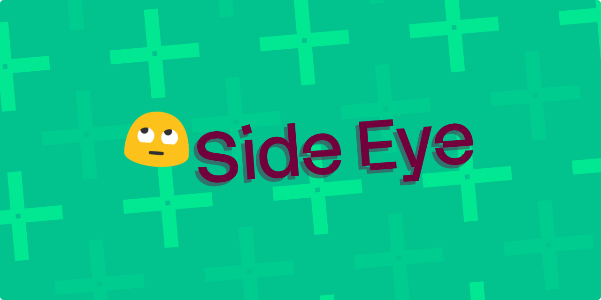

# Side Eye 😒



> Give a project the side-eye before you trust it.

side-eye shows you what would run code on your machine when you clone, open, install, or build a project. It reads files. It never runs `git`, a build, a hook, or a script from the repository it is scanning.

## Install

```bash
curl -sfL https://github.com/nisrulz/side-eye/releases/latest/download/install.sh | sh
```

The installer checks the release against a SHA-256 checksum, installs `side-eye` to `~/go/bin`, and adds that directory to your PATH if it is missing. No Go toolchain needed.

Building from source is covered in the [development docs](docs/development.md).

## Usage

Scan the project you are standing in:

```bash
cd ~/example/project
side-eye
```

Or point it at a target:

```bash
side-eye ~/example/project              # a directory, with or without git
side-eye https://github.com/example/project  # a repository URL, without cloning it
side-eye git@github.com:example/project.git  # an SSH URL works the same way
side-eye ~/Downloads/project-main.zip  # a ZIP from GitHub or shared by someone
```

Every target runs the same worktree checks — the shell, Gradle, CMake, NDK, adb,
npm, and VS Code surfaces. Only `.git/config` and `.git/hooks` depend on the
target shape. An SSH URL keeps its SSH form in the clone command the report
prints.

## Reading the output

A clean project prints one line:

```text
✅ No code that runs on clone, open, or commit in ~/example/project
```

A project with findings prints a table, worst first. Each finding carries what it does and what to do about it:

```text
┌─────────────┬───────────────────────┬────────────────────────────────────────┐
│ SEVERITY    │ LOCATION              │ FINDING                                │
├─────────────┼───────────────────────┼────────────────────────────────────────┤
│ 🚨 CRITICAL │ .git/hooks/pre-commit │ Active git hook: pre-commit            │
│             │                       │ ↳ Active hook; runs on git commit      │
│             │                       │ 👉 Do not clone, open, or run git here │
│             │                       │ until you review this.                 │
└─────────────┴───────────────────────┴────────────────────────────────────────┘

→ 1 risky item: 1 critical
```

| Severity | Means |
| --- | --- |
| 🚨 CRITICAL | Code runs on clone, checkout, open, or install, and you did not ask for it |
| 🔴 HIGH | Code fetches and then runs something, or sends data off your machine |
| 🟠 MEDIUM | Code runs on a build or commit step, or a credential is exposed |
| 🟡 LOW | Worth a look before you trust the project |
| ⚪ INFO | Informational |

## What it checks

| Surface | Examples |
| --- | --- |
| Git | [`core.hooksPath`](https://socprime.com/active-threats/lazarus-group-uses-git-hooks-to-hide-malware-dprks-contagious-interview-and-taskjacker-campaign-is-now-hiding-its-second-stage-loader-inside-git-hooks-that-download-invisibleferret-and-beave/), `filter.*.smudge`, `diff.external`, shell `alias.*`, hooks in `.git/hooks` or a tracked hooks directory, `.gitattributes`, [`.gitmodules`](https://github.blog/open-source/git/securing-git-addressing-5-new-vulnerabilities/) |
| VS Code | A [`tasks.json`](https://socprime.com/active-threats/contagious-interview-tracking-the-vs-code-tasks-infection-vector/) task with `runOn: folderOpen`, a task that [pipes a download into a shell](https://www.sentinelone.com/blog/unseen-threats-in-software-development-the-perils-of-trojanized-npm-packages/), workspace settings that allow tasks, dev container lifecycle commands |
| Node.js | [`postinstall`](https://www.sentinelone.com/blog/unseen-threats-in-software-development-the-perils-of-trojanized-npm-packages/) and the other install-time scripts, [`.npmrc` `onload-script`](https://github.com/npm/cli/issues/4101), yarn plugins, [pre-commit and husky hooks](https://socprime.com/active-threats/lazarus-group-uses-git-hooks-to-hide-malware-dprks-contagious-interview-and-taskjacker-campaign-is-now-hiding-its-second-stage-loader-inside-git-hooks-that-download-invisibleferret-and-beave/) |
| Shell | [`.envrc`](https://github.com/direnv/direnv/issues/445), a `Makefile` target, a setup script that [downloads and pipes into `sh`](https://github.com/Layr-Labs/d-inference/issues/711) |
| Android | A [Gradle script](https://safeguard.sh/resources/blog/gradle-build-script-injection-and-plugin-supply-chain-attacks) that downloads or runs a command, a tampered Gradle wrapper JAR, `execute_process` in CMake, `$(shell` in `Android.mk`, `adb install`, a `.jks` or a secret in `gradle.properties` |

Ordinary projects stay quiet: comments, plain repository URLs, and a project's own build commands are not findings. See the [local checks docs](docs/local-checks.md) for what each rule ignores.

## Flags

| Flag | Default | Effect |
| --- | --- | --- |
| `-json` | off | Print findings as JSON, with no color |
| `-ref` | host default | Branch or tag to scan on a URL target |
| `-token-file` | none | Read the token for a private repository from this file |
| `-fail-on` | `high` | Lowest severity that exits 1: `low`, `medium`, `high`, `critical`, `none` |
| `-llm` | off | Add the LLM review pass |

For a private repository, set `GITHUB_TOKEN` or `GH_TOKEN` rather than passing a
token on the command line, where any process on the machine can read it out of
`ps`.

## Use it in CI

Exit code 1 means a finding reached `-fail-on`, and 2 means the scan could not run at all. A GitHub Actions step:

```yaml
- run: curl -sfL https://github.com/nisrulz/side-eye/releases/latest/download/install.sh | sh
- run: side-eye --fail-on critical .
```

Add `-json` when a job should post or store findings instead of printing them for a person. The [reporting docs](docs/reporting.md) have the JSON shape and every exit code.

## LLM review (optional)

`-llm` sends the project's execution surface to an OpenAI-compatible endpoint and asks the model what it would run. It is off by default because it sends repository content to an endpoint you pick.

```bash
export SIDE_EYE_LLM_URL=http://localhost:11434/v1
export SIDE_EYE_LLM_MODEL=gemma4:e2b-it-qat
side-eye -llm .
```

A timeout or a refused connection turns into one note in the report, and the regular checks are never replaced.

The [LLM server docs](docs/llm-servers.md) have the variables, the setup for Ollama, LM Studio, and Unsloth Studio, and when to raise the timeout. [llm-scan.md](docs/llm-scan.md) covers what gets sent to the model and how the pass behaves.

## Limits worth knowing

Everything below is the whole list. Every worktree check runs against a directory,
a URL, and a ZIP alike.

| Target | What it cannot see |
| --- | --- |
| Repository URL | `.git/config` and `.git/hooks`. They exist only after a clone, so use `--fail-on critical` and review the clone command the report prints |
| ZIP from GitHub | The same, because a GitHub source archive has no `.git`. A ZIP shared by hand can carry one, and it is scanned |
| Plain directory | No git config or hooks directory, so those checks are skipped and the report says so |

## Developer docs

| Doc | Covers |
| --- | --- |
| [architecture.md](docs/architecture.md) | Scan lifecycle and module map |
| [rules.md](docs/rules.md) | Every git config rule and its severity |
| [local-checks.md](docs/local-checks.md) | Hooks, attributes, and each worktree check |
| [remote-scans.md](docs/remote-scans.md) | URL parsing, remote and ZIP sources |
| [llm-scan.md](docs/llm-scan.md) | What the LLM pass sends, its prompt, and its caps |
| [llm-servers.md](docs/llm-servers.md) | LLM server setup, environment variables, timeout |
| [reporting.md](docs/reporting.md) | Findings, output formats, exit codes |
| [development.md](docs/development.md) | Build, install, test, conventions |

The [developer docs index](docs/dev.md) lists them all with a note on each.

## License

[](LICENSE)
